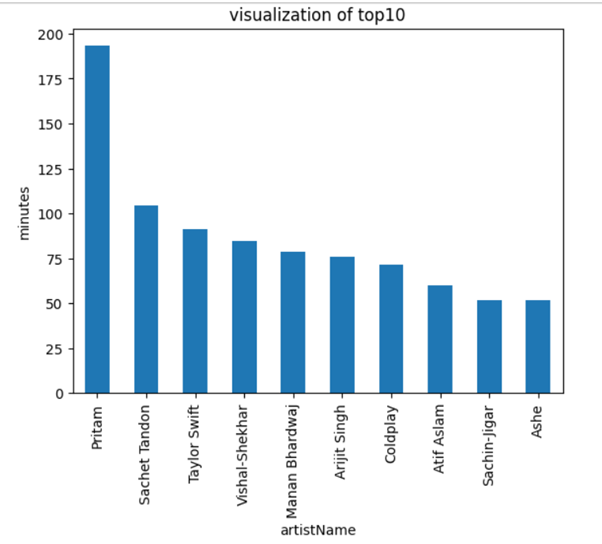
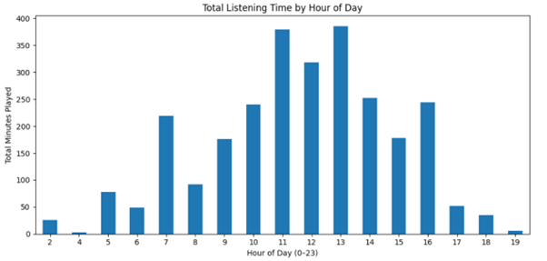

# Spotify Listening Pattern Analysis

This project analyzes my Spotify listening history to uncover behavioral insights using Python and essential data science libraries like Pandas and Matplotlib.

## 📌 What It Covers

- Data cleaning and filtering of raw JSON logs
- Conversion of timestamps and duration features
- Aggregation of listening time by:
  - Artist
  - Hour of day
  - Day of week
- Visualizations for each trend using bar charts

## 🔧 Tech Stack

- Python latest
- Jupyter Notebook
- Pandas
- Matplotlib

## 📈 Outcome

This was my first data science project using personal data. I wrote every step from scratch and deeply understood:
- How to clean and transform real-world JSON data
- How to group and visualize key trends
- The workflow of building a complete exploratory analysis

---

## 📁 Files

- `spotify-analysis.ipynb` — the complete notebook
- `README.md` — this document

## ✅ Status

Complete — ready for future extensions like:
- Clustering by genre/mood
- Song recommendations
- Comparative analysis across months

## 📌 How to use

Download your spotify data from your account and paste the path in the notebook and run!!

## 📸 Sample Output

### 🎵 Top 10 Artists by Listening Time

### 🕒 Listening Time by Hour of Day

### 🕒 Listening Time by Day of Week
